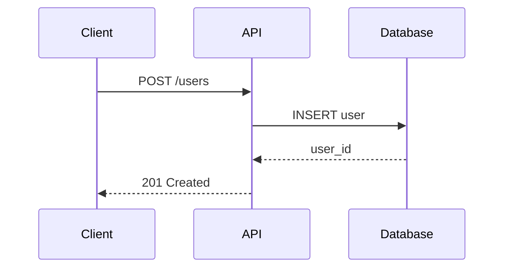

# Docs as Code 가이드

MkDocs, Docusaurus, Backstage TechDocs, API 문서 자동화

## Quick Reference (결정 트리)

```
문서 도구 선택?
    |
    +-- Python 생태계/간단 ---------> MkDocs + Material
    |       |
    |       +-- 기술 문서 중심 -----> MkDocs Material
    |       +-- Backstage 통합 ----> TechDocs
    |
    +-- React/JS 생태계 ------------> Docusaurus
    |       |
    |       +-- 버전 관리 필요 -----> Docusaurus
    |       +-- 다국어 지원 --------> Docusaurus
    |
    +-- API 문서 -------------------> OpenAPI + 자동화
            |
            +-- REST API -----------> Swagger UI / Redoc
            +-- GraphQL ------------> GraphQL Playground

문서 호스팅?
    |
    +-- GitHub Pages ---------------> 무료, 간단
    +-- Netlify/Vercel -------------> CI/CD 통합
    +-- Backstage TechDocs ---------> 내부 포털
```

---

## CRITICAL: Docs as Code 원칙

| 원칙 | 설명 | 실천 |
|------|------|------|
| **버전 관리** | Git으로 문서 추적 | 코드와 함께 저장 |
| **코드 리뷰** | PR로 문서 검토 | 기술 정확성 보장 |
| **자동화** | CI/CD로 빌드/배포 | 수동 작업 제거 |
| **코드 근접** | 코드와 문서 함께 | 동기화 유지 |
| **재사용** | 컴포넌트화 | 중복 제거 |

### 문서 부재 비용

```
중견 팀 (50명) 연간 손실:
    |
    +-- 온보딩 지연 ------------> $200K-$500K
    +-- 지식 검색 시간 ---------> $150K-$300K
    +-- 반복 질문 응답 ---------> $100K-$200K
    +-- 잘못된 구현 재작업 -----> $200K-$500K
    |
    총계: $500K - $2M/년 손실 가능
```

---

## MkDocs + Material

### 설치 및 설정

```bash
# 설치
pip install mkdocs-material
pip install mkdocs-awesome-pages-plugin
pip install mkdocs-git-revision-date-localized-plugin

# 프로젝트 생성
mkdocs new my-docs
cd my-docs
```

### mkdocs.yml 설정

```yaml
site_name: My Project Documentation
site_url: https://docs.example.com
site_description: "프로젝트 기술 문서"

repo_name: myorg/myproject
repo_url: https://github.com/myorg/myproject

theme:
  name: material
  language: ko
  palette:
    - scheme: default
      primary: indigo
      accent: indigo
      toggle:
        icon: material/brightness-7
        name: 다크 모드
    - scheme: slate
      primary: indigo
      accent: indigo
      toggle:
        icon: material/brightness-4
        name: 라이트 모드
  features:
    - navigation.tabs
    - navigation.sections
    - navigation.expand
    - navigation.top
    - search.suggest
    - search.highlight
    - content.code.copy
    - content.code.annotate

plugins:
  - search:
      lang: ko
  - git-revision-date-localized:
      type: date
      enable_creation_date: true
  - awesome-pages

markdown_extensions:
  - admonition
  - codehilite
  - toc:
      permalink: true
  - pymdownx.superfences:
      custom_fences:
        - name: mermaid
          class: mermaid
          format: !!python/name:pymdownx.superfences.fence_code_format
  - pymdownx.tabbed:
      alternate_style: true
  - pymdownx.details
  - pymdownx.emoji:
      emoji_index: !!python/name:material.extensions.emoji.twemoji
      emoji_generator: !!python/name:material.extensions.emoji.to_svg

nav:
  - Home: index.md
  - Getting Started:
      - Installation: getting-started/installation.md
      - Quick Start: getting-started/quickstart.md
  - Guides:
      - API Guide: guides/api.md
      - Deployment: guides/deployment.md
  - Reference:
      - API Reference: reference/api.md
      - Configuration: reference/config.md
```

### 문서 구조

```
docs/
├── index.md
├── getting-started/
│   ├── installation.md
│   └── quickstart.md
├── guides/
│   ├── api.md
│   └── deployment.md
├── reference/
│   ├── api.md
│   └── config.md
├── assets/
│   └── images/
└── stylesheets/
    └── extra.css
```

### 예시 문서

```markdown
# API 가이드

이 가이드는 API 사용 방법을 설명합니다.

## 인증

!!! warning "중요"
    모든 API 요청에는 인증 토큰이 필요합니다.

### Bearer 토큰

=== "cURL"

    ```bash
    curl -H "Authorization: Bearer <token>" \
      https://api.example.com/v1/users
    ```

=== "Python"

    ```python
    import requests

    headers = {"Authorization": "Bearer <token>"}
    response = requests.get(
        "https://api.example.com/v1/users",
        headers=headers
    )
    ```

## 시퀀스 다이어그램



## 참고

자세한 내용은 [API 레퍼런스](../reference/api.md)를 참조하세요.
```

---

## Docusaurus

### 설치 및 설정

```bash
# 프로젝트 생성
npx create-docusaurus@latest my-docs classic --typescript

cd my-docs
npm run start
```

### docusaurus.config.ts

```typescript
import {themes as prismThemes} from 'prism-react-renderer';
import type {Config} from '@docusaurus/types';

const config: Config = {
  title: 'My Project',
  tagline: '프로젝트 문서',
  url: 'https://docs.example.com',
  baseUrl: '/',

  organizationName: 'myorg',
  projectName: 'myproject',

  i18n: {
    defaultLocale: 'ko',
    locales: ['ko', 'en'],
  },

  presets: [
    [
      'classic',
      {
        docs: {
          sidebarPath: './sidebars.ts',
          editUrl: 'https://github.com/myorg/myproject/tree/main/docs/',
          // 버전 관리
          lastVersion: 'current',
          versions: {
            current: {
              label: '2.0',
              path: '',
            },
          },
        },
        blog: {
          showReadingTime: true,
          editUrl: 'https://github.com/myorg/myproject/tree/main/blog/',
        },
        theme: {
          customCss: './src/css/custom.css',
        },
      },
    ],
  ],

  themeConfig: {
    navbar: {
      title: 'My Project',
      items: [
        {
          type: 'docSidebar',
          sidebarId: 'tutorialSidebar',
          position: 'left',
          label: '문서',
        },
        {
          to: '/blog',
          label: '블로그',
          position: 'left'
        },
        {
          type: 'docsVersionDropdown',
          position: 'right',
        },
        {
          type: 'localeDropdown',
          position: 'right',
        },
        {
          href: 'https://github.com/myorg/myproject',
          label: 'GitHub',
          position: 'right',
        },
      ],
    },
    prism: {
      theme: prismThemes.github,
      darkTheme: prismThemes.dracula,
      additionalLanguages: ['bash', 'yaml', 'json'],
    },
    algolia: {
      appId: 'YOUR_APP_ID',
      apiKey: 'YOUR_API_KEY',
      indexName: 'myproject',
    },
  },
};

export default config;
```

### 버전 관리

```bash
# 새 버전 생성
npm run docusaurus docs:version 1.0

# 버전별 문서 구조
docs/
├── intro.md (현재 버전)
└── ...
versioned_docs/
├── version-1.0/
│   └── intro.md
└── ...
versioned_sidebars/
└── version-1.0-sidebars.json
```

---

## Backstage TechDocs

### 아키텍처

```
+------------------------------------------------------------------+
|                     Backstage Platform                             |
+------------------------------------------------------------------+
|                                                                    |
|  +-------------+  +-------------+  +-------------+                 |
|  | Catalog     |  | TechDocs    |  | Scaffolder  |                 |
|  | (Entities)  |  | (Docs)      |  | (Templates) |                 |
|  +-------------+  +-------------+  +-------------+                 |
|                         |                                          |
|                         v                                          |
|  +----------------------------------------------------------+     |
|  |                  TechDocs Backend                         |     |
|  |  - MkDocs 빌드                                           |     |
|  |  - S3/GCS 저장                                           |     |
|  |  - 문서 검색                                              |     |
|  +----------------------------------------------------------+     |
|                                                                    |
+------------------------------------------------------------------+
```

### catalog-info.yaml 설정

```yaml
apiVersion: backstage.io/v1alpha1
kind: Component
metadata:
  name: my-service
  description: "My Service Description"
  annotations:
    # TechDocs 활성화
    backstage.io/techdocs-ref: dir:.

spec:
  type: service
  lifecycle: production
  owner: team-platform
```

### TechDocs 설정

```yaml
# mkdocs.yml (프로젝트 루트)
site_name: My Service
site_description: "Service documentation"

plugins:
  - techdocs-core

nav:
  - Home: index.md
  - Architecture: architecture.md
  - API: api.md
  - Runbooks: runbooks.md
```

### Backstage app-config.yaml

```yaml
techdocs:
  builder: 'local'  # 또는 'external'
  generator:
    runIn: 'local'  # 또는 'docker'
  publisher:
    type: 'awsS3'  # 또는 'googleGcs', 'azureBlobStorage'
    awsS3:
      bucketName: techdocs-bucket
      region: ap-northeast-2
      credentials:
        roleArn: arn:aws:iam::123456789:role/techdocs-role
```

### CI/CD 빌드

```yaml
# .github/workflows/techdocs.yaml
name: TechDocs Build

on:
  push:
    paths:
      - 'docs/**'
      - 'mkdocs.yml'

jobs:
  build:
    runs-on: ubuntu-latest
    steps:
      - uses: actions/checkout@v4

      - name: Setup Node
        uses: actions/setup-node@v4
        with:
          node-version: '20'

      - name: Install techdocs-cli
        run: npm install -g @techdocs/cli

      - name: Generate docs
        run: techdocs-cli generate --no-docker

      - name: Publish to S3
        run: |
          techdocs-cli publish \
            --publisher-type awsS3 \
            --storage-name techdocs-bucket \
            --entity default/Component/my-service
        env:
          AWS_ACCESS_KEY_ID: ${{ secrets.AWS_ACCESS_KEY_ID }}
          AWS_SECRET_ACCESS_KEY: ${{ secrets.AWS_SECRET_ACCESS_KEY }}
```

---

## Anti-Patterns

| 실수 | 문제 | 해결 |
|------|------|------|
| 문서와 코드 분리 저장소 | 동기화 누락 | 같은 저장소 유지 |
| 수동 배포 | 문서 최신화 지연 | CI/CD 자동화 |
| 리뷰 없이 머지 | 품질 저하 | PR 리뷰 필수 |
| 스크린샷 과다 | 업데이트 어려움 | 텍스트 + 다이어그램 |
| 버전 관리 없음 | 구버전 혼란 | 명시적 버전 문서 |

---

## 체크리스트

### 초기 설정
- [ ] 문서 도구 선택 (MkDocs/Docusaurus)
- [ ] 프로젝트 구조 설계
- [ ] CI/CD 파이프라인 구성

### 콘텐츠
- [ ] Getting Started 가이드
- [ ] API 레퍼런스
- [ ] 아키텍처 문서
- [ ] 런북/트러블슈팅

### Backstage
- [ ] TechDocs 설정
- [ ] catalog-info.yaml 추가
- [ ] 자동 빌드 파이프라인

## 참조 스킬

- `/docs-as-code-automation` - API 문서 자동화, 문서 품질 측정
- `/backstage` - Backstage 플랫폼
- `/dx-onboarding` - 온보딩 가이드
