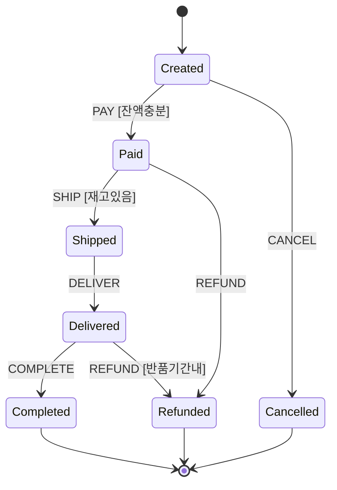
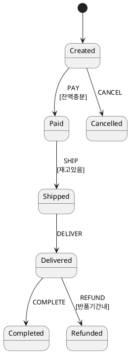

# 도메인 상태머신 가이드

도메인 엔티티의 상태 전이 관리, FSM 구현 패턴, 이벤트 기반 상태 변경, 감사 추적

## Quick Reference (결정 트리)

```
상태 관리가 필요한가?
    ├─ 상태 2~3개, 전이 단순 ─────────> 단순 Enum + if/switch
    ├─ 상태 5~15개, Guard/Action 필요 ─> FSM 라이브러리
    │    ├─ Go ─────────────────────> looplab/fsm 또는 직접 구현
    │    ├─ Java/Spring ────────────> Spring State Machine
    │    └─ Node.js ────────────────> xstate
    ├─ 상태 15개+, 조건부 분기 복잡 ──> 워크플로우 엔진 (Temporal, Camunda)
    └─ 감사 추적 + 이력 재생 필요 ───> FSM + Event Sourcing

전이 테이블 관리?
    ├─ 코드 내 하드코딩 ─────> 소규모, 변경 적음
    ├─ YAML/JSON 정의 ───────> 런타임 변경, A/B 테스트
    └─ DB 기반 동적 전이 ────> 멀티 테넌트, 고객별 워크플로우
```

---

## 기본 개념

| 구성 요소 | 설명 | 예시 |
|-----------|------|------|
| **State** | 엔티티의 현재 상태 | `CREATED`, `PAID`, `SHIPPED` |
| **Event** | 전이를 트리거하는 입력 | `PAY`, `SHIP`, `CANCEL` |
| **Transition** | 현재 상태 + 이벤트 → 다음 상태 | `CREATED + PAY → PAID` |
| **Guard** | 전이 허용 조건 | `잔액 >= 주문금액` |
| **Action** | 전이 시 실행되는 부수 효과 | 이메일 발송, 재고 차감 |

## 주문 상태 전이 테이블

```
 현재 상태  │  이벤트  │ 다음 상태  │ Guard           │ Action
────────────┼─────────┼───────────┼─────────────────┼────────────────
 CREATED    │ PAY     │ PAID      │ 잔액 >= 금액    │ 결제 처리
 CREATED    │ CANCEL  │ CANCELLED │ -               │ 취소 알림
 PAID       │ SHIP    │ SHIPPED   │ 재고 > 0        │ 재고 차감
 PAID       │ REFUND  │ REFUNDED  │ 결제 후 24h이내 │ 환불 처리
 SHIPPED    │ DELIVER │ DELIVERED │ -               │ 배송완료 알림
 DELIVERED  │ COMPLETE│ COMPLETED │ -               │ 포인트 적립
 DELIVERED  │ REFUND  │ REFUNDED  │ 반품 7일 이내   │ 반품+환불
```



---

## Go 구현: looplab/fsm

```go
package order

import (
    "context"
    "fmt"
    "time"
    "github.com/looplab/fsm"
)

type Order struct {
    ID     string
    Amount int64
    FSM    *fsm.FSM
    PaidAt *time.Time
}

func NewOrder(id string, amount int64) *Order {
    o := &Order{ID: id, Amount: amount}
    o.FSM = fsm.NewFSM(
        "created",
        fsm.Events{
            {Name: "pay",     Src: []string{"created"},            Dst: "paid"},
            {Name: "cancel",  Src: []string{"created"},            Dst: "cancelled"},
            {Name: "ship",    Src: []string{"paid"},               Dst: "shipped"},
            {Name: "refund",  Src: []string{"paid", "delivered"},  Dst: "refunded"},
            {Name: "deliver", Src: []string{"shipped"},            Dst: "delivered"},
            {Name: "complete",Src: []string{"delivered"},           Dst: "completed"},
        },
        fsm.Callbacks{
            "before_pay": func(_ context.Context, e *fsm.Event) {
                if o.Amount <= 0 {
                    e.Cancel(fmt.Errorf("invalid amount: %d", o.Amount))
                }
            },
            "after_pay": func(_ context.Context, e *fsm.Event) {
                now := time.Now()
                o.PaidAt = &now
            },
            "enter_state": func(_ context.Context, e *fsm.Event) {
                fmt.Printf("[%s] %s -> %s\n", o.ID, e.Src, e.Dst)
            },
        },
    )
    return o
}
```

## Go 구현: 직접 구현 (테이블 기반)

```go
package statemachine

import (
    "fmt"
    "sync"
)

type State string
type Event string
type TransitionKey struct{ From State; Event Event }

type TransitionDef struct {
    To     State
    Guard  func(ctx interface{}) error
    Action func(ctx interface{}) error
}

type StateMachine struct {
    mu          sync.RWMutex
    current     State
    transitions map[TransitionKey]TransitionDef
    listeners   []func(from, to State, event Event)
}

func New(initial State) *StateMachine {
    return &StateMachine{current: initial, transitions: make(map[TransitionKey]TransitionDef)}
}

func (sm *StateMachine) AddTransition(from State, event Event, def TransitionDef) {
    sm.transitions[TransitionKey{From: from, Event: event}] = def
}

func (sm *StateMachine) Trigger(event Event, ctx interface{}) error {
    sm.mu.Lock()
    defer sm.mu.Unlock()
    key := TransitionKey{From: sm.current, Event: event}
    def, ok := sm.transitions[key]
    if !ok {
        return fmt.Errorf("invalid transition: %s + %s", sm.current, event)
    }
    if def.Guard != nil {
        if err := def.Guard(ctx); err != nil {
            return fmt.Errorf("guard failed: %w", err)
        }
    }
    from := sm.current
    sm.current = def.To
    if def.Action != nil {
        if err := def.Action(ctx); err != nil {
            sm.current = from // 롤백
            return fmt.Errorf("action failed: %w", err)
        }
    }
    for _, fn := range sm.listeners {
        fn(from, def.To, event)
    }
    return nil
}
```

---

## Spring State Machine 구현

```java
public enum OrderState {
    CREATED, PAID, SHIPPED, DELIVERED, COMPLETED, CANCELLED, REFUNDED
}
public enum OrderEvent {
    PAY, CANCEL, SHIP, DELIVER, COMPLETE, REFUND
}

@Configuration
@EnableStateMachineFactory
public class OrderStateMachineConfig
        extends StateMachineConfigurerAdapter<OrderState, OrderEvent> {

    @Override
    public void configure(StateMachineStateConfigurer<OrderState, OrderEvent> states)
            throws Exception {
        states.withStates()
            .initial(OrderState.CREATED)
            .end(OrderState.COMPLETED).end(OrderState.CANCELLED).end(OrderState.REFUNDED)
            .states(EnumSet.allOf(OrderState.class));
    }

    @Override
    public void configure(StateMachineTransitionConfigurer<OrderState, OrderEvent> t)
            throws Exception {
        t.withExternal().source(CREATED).target(PAID).event(PAY)
                .guard(balanceGuard()).action(paymentAction()).and()
         .withExternal().source(CREATED).target(CANCELLED).event(CANCEL).and()
         .withExternal().source(PAID).target(SHIPPED).event(SHIP)
                .guard(inventoryGuard()).action(shipmentAction()).and()
         .withExternal().source(PAID).target(REFUNDED).event(REFUND)
                .guard(refundTimeGuard()).and()
         .withExternal().source(SHIPPED).target(DELIVERED).event(DELIVER).and()
         .withExternal().source(DELIVERED).target(COMPLETED).event(COMPLETE).and()
         .withExternal().source(DELIVERED).target(REFUNDED).event(REFUND)
                .guard(returnPeriodGuard());
    }

    @Bean
    public Guard<OrderState, OrderEvent> balanceGuard() {
        return ctx -> {
            Long balance = (Long) ctx.getExtendedState().getVariables().get("balance");
            Long amount = (Long) ctx.getExtendedState().getVariables().get("amount");
            return balance != null && amount != null && balance >= amount;
        };
    }
}
```

---

## Event Sourcing + 상태머신 통합

상태머신의 전이 이벤트를 Event Store에 저장하면, 이벤트 리플레이로 현재 상태를 재구성할 수 있다.

```go
type OrderAggregate struct {
    ID      string
    State   State
    Version int
    Events  []DomainEvent
}

// 이벤트 리플레이로 상태 복원
func (a *OrderAggregate) Apply(event DomainEvent) {
    switch event.Type {
    case "OrderCreated":  a.State = "created"
    case "OrderPaid":     a.State = "paid"
    case "OrderShipped":  a.State = "shipped"
    case "OrderCancelled":a.State = "cancelled"
    }
    a.Version = event.Version
}

// 커맨드 처리: Guard 검증 → 이벤트 생성
func (a *OrderAggregate) Pay(amount int64) (DomainEvent, error) {
    if a.State != "created" {
        return DomainEvent{}, fmt.Errorf("cannot pay: state is %s", a.State)
    }
    event := DomainEvent{
        Type: "OrderPaid", Version: a.Version + 1,
        Payload: map[string]interface{}{"amount": amount},
    }
    a.Apply(event)
    a.Events = append(a.Events, event)
    return event, nil
}
```

---

## YAML 기반 전이 테이블 정의

코드 외부에서 전이 규칙을 정의하면 비즈니스 변경 시 코드 수정 없이 대응 가능하다.

```yaml
stateMachine:
  name: order
  initial: created
  transitions:
    - { event: pay,     from: [created],        to: paid,      guard: balance_sufficient }
    - { event: cancel,  from: [created],        to: cancelled                            }
    - { event: ship,    from: [paid],           to: shipped,   guard: inventory_available }
    - { event: deliver, from: [shipped],        to: delivered                             }
    - { event: complete,from: [delivered],       to: completed                             }
    - { event: refund,  from: [paid, delivered], to: refunded,  guard: within_refund_period}
  guards:
    balance_sufficient:  { type: expression, expr: "ctx.balance >= order.amount" }
    inventory_available: { type: service, service: inventoryService.checkStock }
    within_refund_period:{ type: expression, expr: "now() - order.paidAt < 7d" }
```

---

## Guard & Side Effect 처리 원칙

```
CRITICAL: Action(Side Effect)은 상태 전이와 반드시 분리

1. 전이 자체는 동기적 수행 (상태 변경 + DB 저장)
2. Side Effect는 이벤트 발행 후 비동기 처리 (이메일, 알림)
3. 실패한 Side Effect는 재시도 큐로 이동 (상태 롤백 금지)

┌─ 동기 (트랜잭션 내) ──┐  ┌─ 비동기 (이벤트 기반) ──┐
│  Guard 검증            │  │  이메일 발송            │
│  상태 변경 + DB 저장   │  │  Slack 알림             │
│  이벤트 발행 (Outbox)  │  │  외부 API 호출          │
└───────────────────────┘  └────────────────────────┘
```

---

## 감사 로그 (Audit Trail)

```sql
CREATE TABLE state_transitions (
    id          BIGSERIAL PRIMARY KEY,
    entity_type VARCHAR(50) NOT NULL,     -- 'order', 'payment'
    entity_id   VARCHAR(100) NOT NULL,
    from_state  VARCHAR(50) NOT NULL,
    to_state    VARCHAR(50) NOT NULL,
    event       VARCHAR(50) NOT NULL,
    actor_id    VARCHAR(100),             -- 누가 트리거했는가
    actor_type  VARCHAR(20),              -- 'user', 'system', 'scheduler'
    metadata    JSONB,                    -- IP, 사유 등
    created_at  TIMESTAMPTZ DEFAULT NOW(),
    INDEX idx_entity (entity_type, entity_id)
);
```

---

## 분산 환경 상태 동기화

### 낙관적 잠금 (Optimistic Locking)

```go
func (r *OrderRepo) UpdateState(ctx context.Context, id, newState string, ver int) error {
    result, err := r.db.ExecContext(ctx,
        `UPDATE orders SET state=$1, version=version+1, updated_at=NOW()
         WHERE id=$2 AND version=$3`, newState, id, ver)
    if err != nil { return err }
    rows, _ := result.RowsAffected()
    if rows == 0 { return ErrConcurrentModification }
    return nil
}
```

### 전략 비교

```
낙관적 잠금 + 재시도 : 충돌 빈도 낮을 때, version 컬럼 CAS 패턴
비관적 잠금 (FOR UPDATE) : 충돌 빈도 높을 때, 데드락/타임아웃 주의
분산 잠금 (Redis/etcd) : 여러 서비스가 같은 엔티티 변경 시
Event Sourcing : 이벤트 순서 보장으로 충돌 회피, 파티션 키=entity_id
```

---

## 시각화: 코드에서 Mermaid 자동 생성

```go
func (sm *StateMachine) ToMermaid() string {
    var sb strings.Builder
    sb.WriteString("stateDiagram-v2\n")
    sb.WriteString("    [*] --> " + string(sm.initial) + "\n")
    for key, def := range sm.transitions {
        sb.WriteString(fmt.Sprintf("    %s --> %s : %s\n", key.From, def.To, key.Event))
    }
    for _, s := range sm.terminalStates() {
        sb.WriteString(fmt.Sprintf("    %s --> [*]\n", s))
    }
    return sb.String()
}
```

PlantUML 예시:


---

## Anti-Patterns

| Anti-Pattern | 문제 | 해결 |
|-------------|------|------|
| **God State** | PROCESSING에서 결제+배송+확인 모두 처리 | 상태를 세분화 (Paid→Shipped→Delivered) |
| **Implicit Transitions** | if문 속에 상태 변경이 산재 | 명시적 전이 테이블로 중앙 관리 |
| **Missing Guards** | 전이 조건 없이 무제한 허용 | 비즈니스 규칙을 Guard로 강제 |
| **동기 Side Effect** | 전이 Action에서 외부 서비스 동기 호출 | Outbox 패턴으로 비동기 처리 |
| **전이 이력 미기록** | 현재 상태만 저장 → 디버깅 불가 | Audit Trail 또는 Event Store 활용 |
| **상태 폭발** | 조합 가능한 모든 상태를 평면적으로 정의 | Hierarchical/Parallel State 활용 |

---

## 관련 Skills

- **/msa-saga**: Saga 패턴에서 상태머신을 Orchestrator로 활용
- **/msa-ddd**: Aggregate 내 상태 전이를 도메인 이벤트로 표현
- **/msa-event-driven**: 이벤트 기반 아키텍처에서의 상태 변경 전파
- **/msa-cqrs-eventsourcing**: Event Sourcing으로 상태 이력 관리 및 리플레이

## 참고 레퍼런스

- [looplab/fsm](https://github.com/looplab/fsm) -- Go FSM 라이브러리 (콜백, 이벤트, 비동기)
- [Spring Statemachine](https://spring.io/projects/spring-statemachine/) -- Spring 공식 상태머신 프레임워크
- [State Machine in DDD Context](https://patricsteiner.github.io/state-machine-in-a-ddd-context/) -- DDD 관점 상태머신 설계
- [Temporal Workflow as State Machine](https://temporal.io/blog/saga-pattern-made-easy) -- Temporal 워크플로우를 상태머신으로 활용
